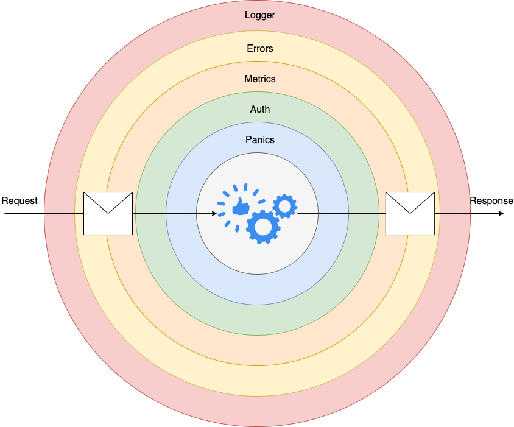

# prime_number

### Schema

### Middlewares diagram

### TODO List

- [x] Find a solution to find the nearest prime number
- [x] Choose tech stacks. Backend: Golang, DB: Postgres, Git: Github, Server: AWS EC2, CI/CD: Github Actions
- [x] Design DB Schema and generate SQL queries
- [x] Set up DB run on a Docker container
- [x] Make DB migrations
- [x] Create a Makefile to shorten the commands
- [x] Create a simple server
- [x] Handle user CRUD, intergrate find the nearest prime number function, write tests
- [x] implement health check, profilling, add middleware, metrics, request logging
- [ ] Implement Authentication and Authorization
- [ ] Create a Dockerfile, and docker-compose 
- [ ] Create frontend by using TypeScript 
- [ ] Deploy project on an AWS EC2 manually
- [ ] Set up Github Actions
